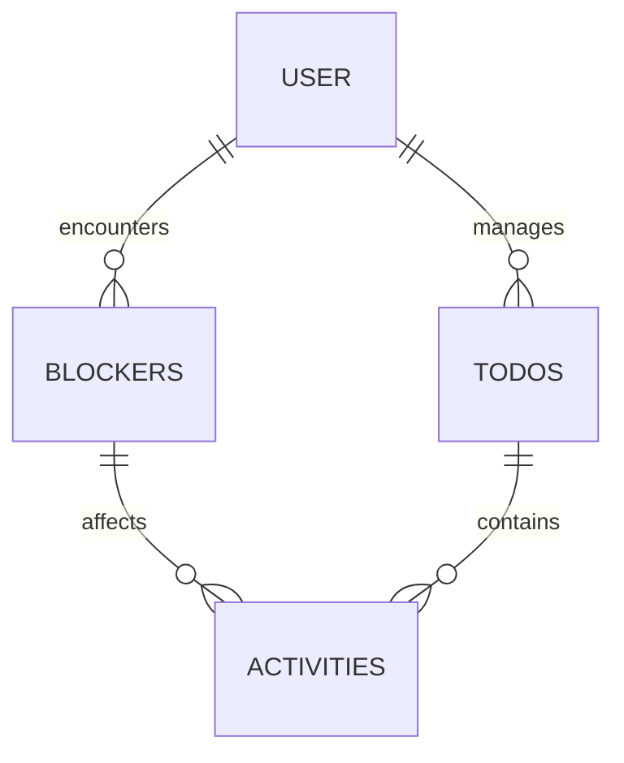

# scatter
Repository for Productivity App- COE Project

## Problem Definition 


The purpose of this application is to help those who are described as being scatter-brained, it aims to assist people with organisation, time management and tracking their day-to-day life. Everyday life involves many tasks, obstacles, and distractions in which this application can assist the users with.


## Priorities 

### Must Have:

1. A user must be able to register an account
2. A user must be able to log in
3. A user must be able to log out
4. A user must be able to deactivate an account
5. A user must be able to add, edit, delete and update to-do items
6. Manage a list of obstacles
7. Add, edit, delete obstacles to/from to-do items
8. Manage a list of distractions
9. Add, edit, delete distractions to/from to-do items


### Should Have:

1. Tracking carried out on a day-to-day basis (tracking the individual entries of time spent on a task) 


### Could Have:

1. A user would be able to view a list of to-do trends
2. Could be a responsive website and therefore could be used on mobile
3. A user should be able to reset a password

### Will Not Have:

1. A user will be able to connect to existing Apple/Android applications 
2. A user will be able to send user push notifications/reminders




### Entity Relationship Diagram

```mermaid
%%{init: {'theme':'default'}}%%
erDiagram
    Users ||--o{ Todos  : manages
    Users {
        int id pk 
        string first_name
        string last_name
        string email_address
        varchar(100) password

    }
    Users ||--o{ Blockers : face
    Blockers {
        int id pk 
        int user_id fk
        string title
        string description 
        datetime created_at
        datetime updated_at
        int blocker_type_id
    }
    Blockers ||--|{ Activity_blockers : create

    Blocker_types ||--|{ Blockers : are

    Blocker_types {
        int id pk 
        string description 
        
    }

    Users ||--o{ Todos : manages
    Todos {
        int id pk
        int user_id fk
        string description
        datetime deadline
        datetime created_at
        datetime updated_at
        datetime completed_at

    }
    Todos ||--|{ Activities : contains
    Activities {
        int id pk 
        int todo_id fk
        string title
        string description 
        datetime created_at
        datetime updated_at
        int time_spent

    }
    Activities ||--|{Activity_blockers : face
    Activity_blockers {
        int id pk 
        int blocker_id fk
        int activity_id fk
        int time_spent

    }
 ```

### API Specifications

## Users

Create new user
POST https://scatter.com/users

Return all users
GET https://scatter.com/users

Update a user
PUT https://scatter.com/users/{user_id}

Return certain user
GET https://scatter.com/users/{user_id}

Delete a certain user
DEL https://scatter.com/users/{user_id}


## To-dos

Create new to-do
POST https://scatter.com/todos

Return all to-dos
GET https://scatter.com/todos

Update a to-do
PUT https://scatter.com/users/{todo_id}

Return a certain to-do
GET https://scatter.com/users/{todo_id}

Delete a certain to-do
DEL https://scatter.com/users/{todo_id}


## Activities

Create new activity
POST https://scatter.com/activities

Return all activities
GET https://scatter.com/activities

Update an activity
PUT https://scatter.com/todos/{activity_id}

Return a certain activity
GET https://scatter.com/todos/{activity_id}

Delete a certain activity
DEL https://scatter.com/todos/{activity_id}


## Blockers

Create new blocker
POST https://scatter.com/blockers/{blocker_type_id}

Return all blockers
GET https://scatter.com/blockers

Update a blocker
PUT https://scatter.com/blockers/{blocker_type_id}

Return a certain blocker
GET https://scatter.com/blockers/{blocker_type_id}

Delete a certain blocker
DEL https://scatter.com/blockers/{blocker_type_id}


